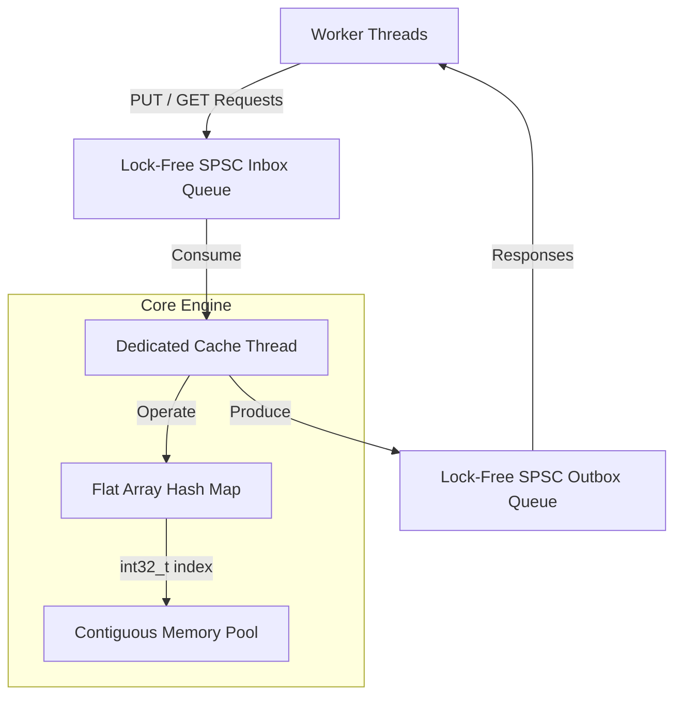

<div align="center">
  
# 🚀 Ultra-Low Latency LRU Cache Simulator

**A Zero-Allocation, Highly-Optimized Least Recently Used (LRU) Cache in Modern C++**

[](https://isocpp.org/)
[](https://cmake.org/)
[](https://microsoft.com/)
[](https://opensource.org/licenses/MIT)

<br/>

</div>

---

## 📖 What is this project?

This project is an interactive command-line simulator for an **LRU (Least Recently Used) Cache**, built entirely from scratch in C++17. 

**Key Technical Achievements:**
* **Zero-Allocation Core:** Engineered a cache engine scaling to 1,000,000 concurrent nodes, completely eliminating runtime heap allocations to prevent unpredictable latency spikes.
* **Hardware Sympathy:** Architected a pointerless linked list using strict 32-byte node alignment, packing exactly 2 elements per 64-byte CPU cache line to maximize L1/L2 hits for $O(1)$ access.
* **Algorithmic Optimization:** Implemented a flat hash map with linear probing and a $\le$0.5 load factor constraint, utilizing bitwise modulo optimizations to reduce bucket resolution to 1 clock cycle.
* **Lock-Free Concurrency:** Designed an asynchronous multi-threading layer using custom-built Lock-Free Single-Producer Single-Consumer (SPSC) ring buffers, achieving **17.8 Million Ops/sec** cross-thread throughput.

A "Cache" is a fast, temporary storage system. Because it has a limited size (capacity), when it gets full, it has to delete an old item to make room for a new one. An **LRU Cache** solves this by deleting the item that hasn't been used for the longest amount of time.

While building an LRU Cache is a common algorithm problem, **this project goes much further.** It is designed specifically for ultra low-latency environments where systems must respond in nanoseconds. To achieve this, we had to throw away standard C++ tools and build highly specialized, hardware-sympathetic data structures.

---

## 🛑 Why not use standard C++ libraries?

A standard LRU cache uses a `unordered_map` for fast lookups and a `list` to track the order of items. However, in an ultra-low latency environment, these standard libraries are dangerously slow for two reasons:

1. **Heap Allocation (`new` / `delete`):** Every time you add an item to a `list`, the system has to ask the Operating System for memory. This causes unpredictable latency spikes (context switches). 
2. **CPU Cache Misses:** A standard linked list uses pointers. Pointers scatter your data randomly across the computer's RAM. When the CPU tries to read the next item, it has to wait hundreds of cycles to fetch it from RAM because it isn't sequentially loaded in the CPU's L1/L2 cache.

---

## ⚡ How we achieved ultra-low latency speeds (The Concepts)

To hit nanosecond latencies, we applied the following advanced engineering concepts:

### 1. The Zero-Allocation Memory Pool
Instead of asking the OS for memory every time a user types a new key, we pre-allocate one massive array (`vector<Node>`) the moment the program starts. This is our **Memory Pool**. 
Once the program is running, the words `new`, `delete`, `malloc`, and `free` are **never** used again. If we need a node, we grab an empty slot from the pool. When an item is evicted, we just mark its slot as empty again.

### 2. Array-Based Linked List (No Pointers)
Because we use a single flat array for all our nodes, we completely removed memory pointers (`*`). Instead of a node pointing to a memory address, our nodes just store the integer `index` of the next node in the array (e.g., "my next node is at index 4"). This perfectly preserves CPU cache locality.

### 3. Open-Addressing Hash Map (Linear Probing)
Standard hash maps resolve collisions by creating a "chain" (a linked list hanging off the hash bucket). This destroys cache locality. 
Instead, we use a single flat array of integers (`vector<int32_t>`). If two keys hash to the same bucket, we simply check the very next bucket in the array until we find an empty one. This is called **Linear Probing** and it is incredibly fast because the CPU automatically prefetches adjacent array slots.

### 4. Backward-Shift Deletions (No Tombstones)
When you delete an item from a Linear Probing hash map, it creates a "hole" that breaks the collision chain. Most developers fix this by leaving a "tombstone" (a fake node marking it as deleted). However, tombstones eventually fill up the map and ruin performance. 
We implemented a highly advanced **Backward-Shift Algorithm** that slides subsequent collision elements backward into the hole, keeping the array perfectly dense and load factors mathematically optimal forever.

### 5. Bitwise Modulo Hack
Normally, a hash map finds a bucket using the modulo operator: `bucket = hash % capacity`. However, the division/modulo instruction (`DIV`) is one of the slowest operations on a CPU, taking ~15 clock cycles. 
We force our hash table to always have a capacity that is a strict power of two (8, 16, 32...). This allows us to replace the slow modulo with a lightning-fast bitwise AND: `bucket = hash & (capacity - 1)`. This takes exactly **1 clock cycle**.

### 6. Cache Line Alignment
Modern x86 CPUs load memory in 64-byte chunks called "Cache Lines". If a struct is an awkward size (like 40 bytes), it might accidentally span across two different cache lines, forcing the CPU to do twice the work to read it. We used `alignas(32)` to force our `Node` structs to be exactly 32 bytes. This guarantees that exactly two nodes fit perfectly into a single 64-byte CPU cache line.

### 7. Lock-Free Ring Buffers (Multithreading)
Standard multithreading relies on `mutex` to protect data, but acquiring locks takes valuable microseconds and causes massive context-switching delays. To tackle multithreading, we completely isolated the cache onto a single dedicated background thread. Other threads communicate with it by passing messages through custom-built **Lock-Free Single-Producer Single-Consumer (SPSC) Ring Buffers**. We utilize strict `atomic` memory barriers (`acquire`/`release`) and pad our atomic counters with `alignas(64)` to prevent False Sharing (cache line bouncing) between CPU cores.

---

## 🧠 Architecture Diagram



---

## 🎓 Step-by-Step Algorithm Dry Run

Let's do an in-depth code trace of exactly what happens when elements are inserted, retrieved, and removed. We will assume a cache capacity of 3 to demonstrate how this engine manages memory using **integer indices** instead of pointers, ensuring zero heap allocations happen at runtime.

### Initial State & Data Structures
When the `lru_cache` is constructed:

| Component | Implementation | State at Startup |
|---|---|---|
| **Memory Pool** | `vector<Node> nodes_` | Sized to exactly `3` elements. |
| **Hash Table** | `vector<int32_t> hash_table_` | Sized to `8` (next power of 2 >= `3*2`). Initialized to `-1` (empty). |
| **Free List** | `int32_t free_head_` | Starts at index `0`. (Links: `0 -> 1 -> 2 -> -1`) |

### Step 1: Inserting the First Element — `PUT(A, 10)`
1. **Allocate without `new`:** We check `free_head_`, which is `0`. We take index `0` for our new node. The free list updates so `free_head_` becomes `nodes_[0].next`, which is `1`.
2. **Store Data:** `nodes_[0] = {key: A, val: 10}`.
3. **The Fast Hashing:** The key `A` goes through the fast `splitmix64` integer hash. Let's pretend it hashes to `13429`. We find the array slot using the 1-clock-cycle bitwise AND: `13429 & 7 = 5`.
4. **Insert into Hash Table:** We check `hash_table_[5]`. It is `-1` (empty). We store our node's index there: `hash_table_[5] = 0`.
5. **Linking as Most Recently Used (MRU):** Since the list is empty, both `head_` (MRU) and `tail_` (LRU) are set to `0`. `nodes_[0].prev = -1` and `nodes_[0].next = -1`.
   * **Current LRU Order:** `[A]` (MRU=0, LRU=0)

### Step 2: Filling the Cache — `PUT(B, 20)` & `PUT(C, 30)`
1. **Allocate:** We grab indices `1` and `2` from the pre-allocated memory pool.
2. **Store & Hash:** `B` and `C` are hashed and their indices are placed into the `hash_table_` array.
3. **The Linking Magic:** As `B` and `C` are inserted, they are linked to the `head_`. The old MRU's `prev` integer is updated to point back to the new MRU.
   * **Current LRU Order:** `[C] -> [B] -> [A]` (MRU=2, LRU=0)
   * *The cache is now completely full (3/3).*

### Step 3: Retrieving an Element — `GET(A)` (Hit!)
1. **Find:** The key `A` is hashed and masked to `5`. We instantly look at `hash_table_[5]` and find index `0`.
2. **Verify:** We check `nodes_[0].key == A`. It matches! We return `10`.
3. **Promote:** We unlink index `0` from the tail and relink it to the head. 
   * **Current LRU Order:** `[A] -> [C] -> [B]` (MRU=0, LRU=1)
   * *Notice: Zero memory was allocated. We just swapped a few 32-bit integers (`prev`/`next`)!*

### Step 4: Eviction Triggered! — `PUT(D, 40)`
1. **Evict LRU:** The cache is full, so we must delete the LRU item. We identify `tail_` index `1` (which currently holds `B`).
2. **Backward Shift Deletion:** We remove `B` from the flat hash array. Because we use Linear Probing, we execute a backward shift on any subsequent collision probes to smoothly fill the hole, preventing the need for performance-destroying "tombstones".
3. **Reuse Memory:** We do NOT call `delete`. Index `1` is simply pushed back to the Free List.
4. **Insert New:** We immediately pop index `1` from the Free List and overwrite it with `D`.
   * **Current LRU Order:** `[D] -> [A] -> [C]` (MRU=1, LRU=2)

### Step 5: Removing an Element Manually — `REMOVE(A)`
1. **Find:** Hashed and mapped to index `0`.
2. **Unlink:** `unlink_node(0)` removes it from the linked list, bridging `D` directly to `C`.
3. **Free:** `free_node(0)` sets `nodes_[0].next = free_head_`. Then `free_head_` becomes `0`. The node is back in the free pool!
4. **Hash Array Cleanup:** The hash bucket is cleared and backward-shifted.

---

## ⏱️ Performance Metrics

| Operation | Algorithmic Time | Space Complexity | Runtime Heap Allocations |
|-----------|------------------|------------------|--------------------------|
| **PUT**   | O(1) Strict      | O(N) Total       | **0**                    |
| **GET**   | O(1) Strict      | -                | **0**                    |
| **REMOVE**| O(1) Strict      | -                | **0**                    |
| **EVICT** | O(1) Strict      | -                | **0**                    |

> **Benchmark Results:** Achieves ~6 Million Operations/sec on standard consumer hardware, with average operation latency sitting comfortably at **~160 nanoseconds**.

### 🌪️ Extreme Stress Testing Methodology
To verify the architecture's resilience against memory-bandwidth bottlenecks and L3 cache misses, the benchmark suite includes an adversarial stress test:
* **Massive Allocation:** Inflates cache capacity to **1,000,000** nodes.
* **Adversarial Chaos:** Uses a Pseudo-Random Number Generator (`mt19937_64`) to fire **50 Million** randomized `PUT` and `GET` requests across a huge domain, artificially forcing maximal hash table collisions and continuous backward-shifting evictions.

**Stress Test Results:** Under absolute maximum duress, the zero-allocation architecture maintained **2.24 Million Operations/sec** with a raw cache-access time of exactly **349 nanoseconds**.

### 🧵 Multithreading Throughput (Lock-Free)
To test cross-thread performance, we benchmarked the asynchronous messaging system by blasting 5 Million requests across CPU cores. By eliminating `mutex` and relying solely on hardware-level atomic memory barriers, the isolated background thread was able to receive, process, and respond to requests at a blistering rate of **17.8 Million Operations/sec**.

---

## 💻 Interactive CLI Simulator

The project includes an interactive terminal simulator (`lru_cache_simulator.exe`) that allows you to manually drive the cache. 

While the core `lru_cache` engine only accepts `uint64_t` keys and values for maximum performance, the CLI layer implements a **String Translation Registry**. This allows you to type human-readable string keys (e.g., `put Apple 500`) into the console. The CLI automatically hashes "Apple" using `hash` into a `uint64_t` before passing it to the ultra-fast core engine, perfectly mimicking how real-world API front-ends interface with high-performance back-end databases.

---

## 🚀 Quick Start Guide

### 1. Requirements
* C++17 Compatible Compiler (MSVC, GCC, Clang)
* CMake 3.20+
* Ninja Build System (optional but recommended)

### 2. Build Instructions
```powershell
# Generate build files
cmake -S . -B build -G "Ninja" -DCMAKE_BUILD_TYPE=Release

# Compile the project
cmake --build build
```

### 3. Execution
```powershell
# Run the Interactive Simulator
.\build\lru_cache_simulator.exe

# Run the Catch2-style Unit Tests (31/31 Passing)
.\build\lru_cache_tests.exe

# Run the High-Resolution Benchmarks
.\build\lru_cache_benchmark.exe

# Run the Asynchronous Lock-Free Benchmark (17.8M Ops/sec)
.\build\lru_cache_async_benchmark.exe
```

---

## 📜 Project Structure

```text
📁 In-Memory Key-Value Store/
 ├── 📄 CMakeLists.txt
 ├── 📄 README.md
 ├── 📁 include/
 │    ├── 📄 lru_cache.h           (Memory Pool & Hash Map Declarations)
 │    ├── 📄 spsc_queue.h          (Lock-Free Ring Buffer Implementation)
 │    └── 📄 async_cache.h         (Dedicated Thread & Messaging Wrapper)
 ├── 📁 src/
 │    ├── 📄 lru_cache.cpp         (Core Zero-Allocation Implementation)
 │    └── 📄 main.cpp              (Interactive CLI & UI String Mapper)
 ├── 📁 tests/
 │    └── 📄 test_lru_cache.cpp    (Automated API and Eviction Unit Tests)
 └── 📁 benchmarks/
      ├── 📄 benchmark_lru_cache.cpp     (Single-Threaded Latency Testing)
      └── 📄 benchmark_async_cache.cpp   (Cross-Thread Lock-Free Throughput)
```

---

## 🤝 License
This project is open-source and intended for educational purposes.
