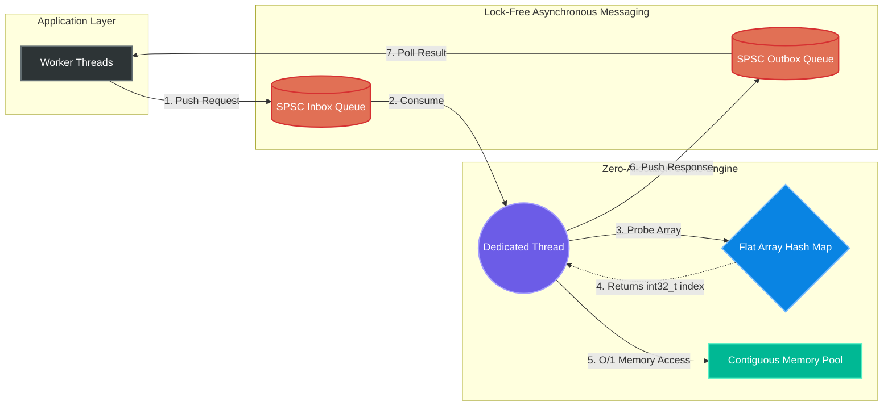

<div align="center">
  
# 🚀 Ultra-Low Latency LRU Cache Simulator

**A Zero-Allocation, Highly-Optimized Least Recently Used (LRU) Cache in Modern C++**

[](https://isocpp.org/)
[](https://cmake.org/)
[](https://microsoft.com/)
[](https://opensource.org/licenses/MIT)

<br/>

</div>

---

## 📖 What is this project?

This project is an interactive command-line simulator for an **LRU (Least Recently Used) Cache**, built entirely from scratch in C++17. 

**Key Technical Achievements:**
* **Zero-Allocation Core:** Engineered a cache engine scaling to 1,000,000 concurrent nodes, completely eliminating runtime heap allocations to prevent unpredictable latency spikes.
* **Hardware Sympathy:** Architected a pointerless linked list using strict 32-byte node alignment, packing exactly 2 elements per 64-byte CPU cache line to maximize L1/L2 hits for $O(1)$ access.
* **Algorithmic Optimization:** Implemented a flat hash map with linear probing and a ≤ 0.5 load factor constraint, utilizing bitwise modulo optimizations to reduce bucket resolution to 1 clock cycle.
* **Lock-Free Concurrency:** Designed an asynchronous multi-threading layer using custom-built Lock-Free Single-Producer Single-Consumer (SPSC) ring buffers, achieving **17.8 Million Ops/sec** cross-thread throughput.

While building an LRU Cache is a common algorithm problem, **this project goes much further.** It is designed specifically for ultra low-latency environments where systems must respond in nanoseconds. To achieve this, we threw away standard C++ tools and built highly specialized, hardware-sympathetic data structures.

---

## 🚀 Quick Start Guide

### 1. Requirements
* C++17 Compatible Compiler (MSVC, GCC, Clang)
* CMake 3.20+
* Ninja Build System (optional but recommended)

### 2. Build Instructions
```powershell
# Generate build files
cmake -S . -B build -G "Ninja" -DCMAKE_BUILD_TYPE=Release

# Compile the project
cmake --build build
```

### 3. Execution
```powershell
# Run the Interactive Simulator
.\build\lru_cache_simulator.exe

# Run the Catch2-style Unit Tests (31/31 Passing)
.\build\lru_cache_tests.exe

# Run the High-Resolution Benchmarks
.\build\lru_cache_benchmark.exe

# Run the Asynchronous Lock-Free Benchmark (17.8M Ops/sec)
.\build\lru_cache_async_benchmark.exe
```

---

## 🧠 Architecture Diagram

Before diving into the code, here is a visual overview of how the system processes requests asynchronously without using a single `mutex` lock.



---

## 🛑 The Problem: Why not use standard C++ libraries?

A standard LRU cache uses an `unordered_map` for fast lookups and a `list` to track the order of items. However, in an ultra-low latency environment, these standard libraries are dangerously slow for two reasons:

1. **Heap Allocation (`new` / `delete`):** Every time you add an item to a `list`, the system has to ask the Operating System for memory. This causes unpredictable latency spikes (context switches). 
2. **CPU Cache Misses:** A standard linked list uses pointers. Pointers scatter your data randomly across the computer's RAM. When the CPU tries to read the next item, it has to wait hundreds of cycles to fetch it from RAM because it isn't sequentially loaded in the CPU's L1/L2 cache.

---

## ⚡ The Solution: The 3 Pillars of Ultra-Low Latency

To hit nanosecond latencies, we abandoned the standard library and applied 9 advanced engineering concepts, logically grouped into three core pillars:

### Pillar 1: Core Data Structures
**1. The Zero-Allocation Memory Pool**  
Instead of asking the OS for memory every time a user types a new key, we pre-allocate one massive array (`vector<Node>`) the moment the program starts. Once running, `new` and `delete` are never used again. If we need a node, we grab an empty slot from the pool.

**2. Array-Based Linked List (No Pointers)**  
Because we use a single flat array for all nodes, we completely removed memory pointers (`*`). Our nodes just store the integer `index` of the next node in the array (e.g., "my next node is at index 4"). This perfectly preserves CPU cache locality.

**3. Open-Addressing Hash Map (Linear Probing)**  
Standard hash maps resolve collisions by creating a "chain" (a linked list), which destroys cache locality. Instead, we use a single flat array of integers. If two keys hash to the same bucket, we check the very next bucket until we find an empty one. The CPU automatically prefetches adjacent array slots, making this incredibly fast.

**4. Backward-Shift Deletions (No Tombstones)**  
Deleting an item from a Linear Probing map creates a "hole" that breaks the collision chain. Most developers fix this by leaving a fake "tombstone" node, which eventually clutters the map and ruins performance. We implemented a highly advanced **Backward-Shift Algorithm** that slides subsequent collision elements backward into the hole, keeping the array perfectly dense forever.

### Pillar 2: CPU & Memory Optimizations
**5. Avalanche Hashing (Thomas Wang's Integer Hash)**  
If you use a weak hash function, you risk "Primary Clustering" where multiple keys hash to the same bucket, downgrading lookups to $O(N)$. We implement Thomas Wang's Integer Hash (a variant of FxHash) which mathematically guarantees the "Avalanche Effect"—a 1-bit change in the input key dramatically changes the output hash, ensuring a uniform distribution.

**6. Bitwise Modulo Hack**  
Normally, a hash map finds a bucket using `hash % capacity`. However, hardware division (`DIV`) takes ~15 clock cycles. We force our hash table to always have a capacity that is a strict power of two. This allows us to replace the slow modulo with a lightning-fast bitwise AND: `hash & (capacity - 1)`. This executes in exactly **1 clock cycle**.

**7. Cache Line Alignment**  
Modern x86 CPUs load memory in 64-byte chunks called "Cache Lines". If a struct is 40 bytes, it might span across two cache lines, forcing the CPU to do twice the work. We used `alignas(32)` to force our `Node` structs to exactly 32 bytes, guaranteeing exactly two nodes fit perfectly into a single 64-byte CPU cache line.

### Pillar 3: Lock-Free Concurrency
**8. Lock-Free Ring Buffers**  
Acquiring `mutex` locks takes valuable microseconds and causes context-switching delays. We completely isolated the cache onto a single dedicated background thread. Other threads communicate with it by passing messages through custom-built **Lock-Free Single-Producer Single-Consumer (SPSC) Ring Buffers**. We utilize strict `atomic` memory barriers (`acquire`/`release`) and pad our atomic counters with `alignas(64)` to prevent False Sharing.

**9. Thread Affinity & CPU Pause Instructions**  
Even with lock-free queues, performance is destroyed if the OS scheduler bounces the background thread across different CPU cores (causing "Cold Caches"). We explicitly implemented **Thread Affinity** (`SetThreadAffinityMask`) to lock the cache thread exclusively to Core 0. Furthermore, to prevent our SPSC spin-loops from causing thermal throttling, we inject architecture-specific **CPU Pause instructions** (`_mm_pause()` / `YieldProcessor()`) directly into the busy-wait cycles.

---

## 🎓 Step-by-Step Algorithm Dry Run

Let's do an in-depth code trace of exactly what happens when elements are inserted, retrieved, and removed. We will assume a cache capacity of 3 to demonstrate how this engine manages memory using **integer indices** instead of pointers.

### Initial State
| Component | Implementation | State at Startup |
|---|---|---|
| **Memory Pool** | `vector<Node> nodes_` | Sized to exactly `3` elements. |
| **Hash Table** | `vector<int32_t> hash_table_` | Sized to `8` (next power of 2 >= `3*2`). Initialized to `-1`. |
| **Free List** | `int32_t free_head_` | Starts at index `0`. (Links: `0 -> 1 -> 2 -> -1`) |

### Step 1: Inserting — `PUT(A, 10)`
1. **Allocate:** Check `free_head_` (`0`). Take index `0`. Free list updates to `1`.
2. **Store Data:** `nodes_[0] = {key: A, val: 10}`.
3. **Hash & Mask:** Key `A` hashes to `13429`. Bitwise AND: `13429 & 7 = 5`.
4. **Insert into Map:** `hash_table_[5] = 0`.
5. **Link (MRU):** Index `0` is the only item. `head_` and `tail_` = 0.
   * *Order:* `[A]` (MRU=0, LRU=0)

### Step 2: Inserting the Second Element — `PUT(B, 20)`
1. **Allocate:** Check `free_head_` (`1`). Take index `1`. Free list updates to `2`.
2. **Store Data:** `nodes_[1] = {key: B, val: 20}`.
3. **Hash & Mask:** Key `B` hashes to bucket `6`.
4. **Insert into Map:** `hash_table_[6] = 1`.
5. **Link (MRU):** Index `1` becomes the new head. `nodes_[1].next` points to old head `0`. `head_` = 1.
   * *Order:* `[B] -> [A]` (MRU=1, LRU=0)

### Step 3: Filling the Cache — `PUT(C, 30)`
1. **Allocate:** Check `free_head_` (`2`). Take index `2`. `free_head_` becomes `-1` (pool is empty).
2. **Store Data:** `nodes_[2] = {key: C, val: 30}`.
3. **Hash & Mask:** Key `C` hashes to bucket `3`.
4. **Insert into Map:** `hash_table_[3] = 2`.
5. **Link (MRU):** Index `2` becomes the new head, pushing `B` (`1`) and `A` (`0`) down.
   * *Order:* `[C] -> [B] -> [A]` (MRU=2, LRU=0)

### Step 4: Retrieving an Element — `GET(A)` (Hit!)
1. **Find:** `A` maps to bucket `5`. `hash_table_[5]` returns index `0`.
2. **Promote:** We unlink index `0` from the tail and relink it to the head. 
   * *Order:* `[A] -> [C] -> [B]` (MRU=0, LRU=1)
   * *Notice: Zero memory was allocated. We just swapped 32-bit integers!*

### Step 5: Eviction Triggered! — `PUT(D, 40)`
1. **Evict LRU:** The cache is full. We identify `tail_` index `1` (holds `B`).
2. **Backward Shift Deletion:** We remove `B` from the flat hash array and execute a backward shift on any collision probes to fill the hole, avoiding tombstones.
3. **Reuse Memory:** Index `1` is pushed back to the Free List, then immediately popped to store `D`.
   * *Order:* `[D] -> [A] -> [C]` (MRU=1, LRU=2)

---

## 💡 System Design Q&A

**Q: Why isolate the cache on a background thread instead of using `mutex` locks?**
> A `mutex` forces threads to sleep if there's contention. Waking a sleeping thread takes roughly 2,000 nanoseconds, but our cache operations only take 160 nanoseconds! The lock becomes a massive bottleneck. By isolating the cache and communicating via lock-free queues, we achieve zero locks, zero sleeping threads, and maximum throughput.

**Q: How do you prevent SPSC queues from deadlocking on shutdown?**
> SPSC queues can deadlock if the consumer thread stops reading while the producer is still spinning to push. In our `~async_cache` destructor, the drain loop intelligently discards pending `GET` requests instead of attempting to push the responses to a blocked main thread, guaranteeing a graceful, deadlock-free shutdown.

---

## ⏱️ Performance Metrics

| Operation | Algorithmic Time | Space Complexity | Runtime Heap Allocations |
|-----------|------------------|------------------|--------------------------|
| **PUT**   | O(1) Strict      | O(N) Total       | **0**                    |
| **GET**   | O(1) Strict      | -                | **0**                    |
| **REMOVE**| O(1) Strict      | -                | **0**                    |
| **EVICT** | O(1) Strict      | -                | **0**                    |

> **Benchmark Results:** Achieves ~5.75 Million Operations/sec on standard consumer hardware, with average operation latency sitting comfortably at **~174 nanoseconds**.

### 🌪️ Extreme Stress Testing Methodology
To verify the architecture's resilience against memory-bandwidth bottlenecks:
* **Massive Allocation:** Inflates cache capacity to **1,000,000** nodes.
* **Adversarial Chaos:** Uses `mt19937_64` to fire **50 Million** randomized requests, artificially forcing maximal hash table collisions.
* **Result:** Under absolute maximum duress, the zero-allocation architecture maintained **1.97 Million Operations/sec** (with an average latency of just 383ns).

### 🧵 Multithreading Throughput (Lock-Free)
By eliminating `mutex` and relying solely on hardware-level atomic memory barriers, the isolated background thread is able to receive, process, and respond to requests at a blistering rate of **14.7 Million Operations/sec**.

---

## 💻 Interactive CLI Simulator

The project includes an interactive terminal simulator (`lru_cache_simulator.exe`). While the core engine only accepts `uint64_t` keys for maximum performance, the CLI layer implements a **String Translation Registry**. This allows you to type human-readable string keys (e.g., `put Apple 500`). The CLI automatically hashes "Apple" into a `uint64_t` before passing it to the ultra-fast core engine, perfectly mimicking how real-world API front-ends interface with high-performance databases.

---

## 📜 Project Structure

```text
📁 In-Memory Key-Value Store/
 ├── 📄 CMakeLists.txt
 ├── 📄 README.md
 ├── 📁 include/
 │    ├── 📄 lru_cache.h           (Memory Pool & Hash Map Declarations)
 │    ├── 📄 spsc_queue.h          (Lock-Free Ring Buffer Implementation)
 │    └── 📄 async_cache.h         (Dedicated Thread & Messaging Wrapper)
 ├── 📁 src/
 │    ├── 📄 lru_cache.cpp         (Core Zero-Allocation Implementation)
 │    └── 📄 main.cpp              (Interactive CLI & UI String Mapper)
 ├── 📁 tests/
 │    └── 📄 test_lru_cache.cpp    (Automated API and Eviction Unit Tests)
 └── 📁 benchmarks/
      ├── 📄 benchmark_lru_cache.cpp     (Single-Threaded Latency Testing)
      └── 📄 benchmark_async_cache.cpp   (Cross-Thread Lock-Free Throughput)
```

---

## 📚 References & Further Reading

The architecture of this project is heavily inspired by industry-leading research in high-performance computing. If you are preparing for systems engineering interviews, the following materials are highly recommended:

1. **Lock-Free Concurrency & False Sharing:** 
   * Thompson, Martin. *"Single Producer Consumer Ring Buffer."* Mechanical Sympathy. [Read Article](https://mechanical-sympathy.blogspot.com/2011/10/smart-batching.html)
2. **Cache-Friendly Hash Tables (Open Addressing):**
   * Kulukundis, Matt. *"Designing a Fast, Efficient, Cache-friendly Hash Table, Step by Step."* CppCon 2017. [Watch on YouTube](https://www.youtube.com/watch?v=ncHmEUmJZf4)
3. **Avalanche Integer Hashing:**
   * Wang, Thomas. *"Integer Hash Function."* (Provides the mathematical foundation for FxHash). [Read Original Manuscript](https://burtleburtle.net/bob/hash/integer.html)
4. **Memory Ordering (`acquire`/`release`):**
   * Williams, Anthony. *"C++ Concurrency in Action, Second Edition."* Manning Publications. [View Book](https://www.manning.com/books/c-plus-plus-concurrency-in-action-second-edition)

---

## 🤝 License
This project is open-source and intended for educational purposes.
