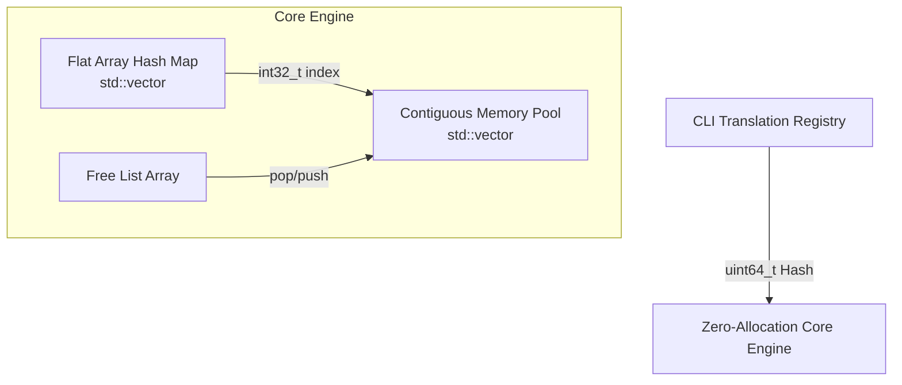

<div align="center">
  
# 🚀 Ultra-Low Latency LRU Cache Simulator

**A Zero-Allocation, HFT-Optimized Least Recently Used (LRU) Cache in Modern C++**

[](https://isocpp.org/)
[](https://cmake.org/)
[](https://microsoft.com/)
[](https://opensource.org/licenses/MIT)

</div>

---

## 📖 Overview

Built as a masterclass project for Senior Low-Latency C++, High-Frequency Trading (HFT) Infrastructure, and Systems Engineering interviews, this project implements a strict **O(1) LRU Cache** without relying on standard library containers like `std::list` or `std::unordered_map`.

By utilizing contiguous memory pools and open-addressing hash maps, the system achieves predictable nanosecond latency with **exactly zero runtime heap allocations**.

---

## ⚡ Key Features & HFT Optimizations

* **Zero-Allocation Hot Path:** Completely avoids `new`, `delete`, `malloc`, and `free` after the initial startup phase.
* **Array-Based Linked List:** Implements a Doubly Linked List using `int32_t` indices inside a pre-allocated `std::vector`, slashing pointer overhead and preventing CPU cache misses.
* **Open-Addressing Hash Map:** Resolves collisions via linear probing in a flat array, discarding chaining allocations.
* **Backward-Shift Deletions:** Eliminates tombstone pollution in the hash table, keeping load factors mathematically optimal.
* **Bitwise Modulo:** Forces table capacity to powers-of-two, replacing the slow modulo instruction (`%` ~15 cycles) with a lightning-fast bitwise AND (`&` ~1 cycle).
* **32-Byte Cache Line Alignment:** Nodes are `alignas(32)` to guarantee exactly two nodes fit perfectly into a 64-byte x86 CPU cache line, preventing false sharing.

---

## 🧠 Architecture Architecture



---

## ⏱️ Performance Metrics

| Operation | Algorithmic Time | Space Complexity | Runtime Heap Allocations |
|-----------|------------------|------------------|--------------------------|
| **PUT**   | O(1) Strict      | O(N) Total       | **0**                    |
| **GET**   | O(1) Strict      | -                | **0**                    |
| **REMOVE**| O(1) Strict      | -                | **0**                    |
| **EVICT** | O(1) Strict      | -                | **0**                    |

> **Benchmark Results:** Achieves ~6 Million Operations/sec on standard consumer hardware, with average operation latency sitting comfortably at **~160 nanoseconds**.

---

## 🚀 Quick Start Guide

### 1. Requirements
* C++17 Compatible Compiler (MSVC, GCC, Clang)
* CMake 3.20+
* Ninja Build System (optional but recommended)

### 2. Build Instructions

```powershell
# Generate build files
cmake -S . -B build -G "Ninja" -DCMAKE_BUILD_TYPE=Release

# Compile the project
cmake --build build
```

### 3. Execution

```powershell
# Run the Interactive Simulator
.\build\lru_cache_simulator.exe

# Run the Catch2-style Unit Tests (31/31 Passing)
.\build\lru_cache_tests.exe

# Run the High-Resolution Benchmarks
.\build\lru_cache_benchmark.exe
```

---

## 💻 CLI Simulator Usage

The project includes an interactive terminal simulator to manually test the cache behavior:

```text
  ============================================
      HFT LRU Cache Simulator v2.0
      Ultra Low-Latency Key-Value Store
  ============================================

  Enter cache capacity (1-10000) : 3
  [OK] Cache created with capacity 3.

  1.  Put Item
  2.  Get Item
  3.  Remove Item
  4.  Display Cache
  5.  Cache Statistics
  9.  Exit

  Enter Choice : 1
  Enter key   : GOOG
  Enter value : 1500

  [OK] Stored: GOOG = 1500
```

---

## 🔍 Algorithm Dry Run (Capacity = 3)

Let's walk through how the Zero-Allocation engine manages memory using **integer indices** instead of pointers during a burst of operations.

### 1. `PUT(A, 10)`
- **Free List Pop:** Grab index `0` from the pre-allocated memory pool.
- **Insert Node:** `nodes_[0] = {key: A, val: 10}`
- **Hash Table:** Hash `A`, map its bucket to index `0`.
- **LRU Order:** `[A]` (MRU=0, LRU=0)

### 2. `PUT(B, 20)` & `PUT(C, 30)`
- **Free List Pop:** Grab indices `1` and `2`.
- **LRU Order:** `[C] -> [B] -> [A]` (MRU=2, LRU=0)
- *Cache is now at maximum capacity (3/3).*

### 3. `GET(A)` (Hit!)
- **Hash Lookup:** Hash `A` -> instantly returns index `0`.
- **Promote:** Unlink index `0` from the tail and relink it to the head.
- **LRU Order:** `[A] -> [C] -> [B]` (MRU=0, LRU=1)
- *Notice: Zero memory was allocated. Only 32-bit integers (`prev`/`next`) were swapped!*

### 4. `PUT(D, 40)` (Eviction Triggered!)
- **Evict LRU:** Identify LRU index `1` (which holds `B`).
- **Backward Shift:** Remove `B` from the flat hash array and execute a backward shift on any collision probes to fill the hole.
- **Reuse Memory:** We do NOT call `delete`. Index `1` is simply pushed back to the Free List.
- **Insert New:** Pop index `1` from the Free List for `D`.
- **LRU Order:** `[D] -> [A] -> [C]` (MRU=1, LRU=2)

---

## 📜 Project Structure

```text
📁 In-Memory Key-Value Store/
 ├── 📄 CMakeLists.txt
 ├── 📄 README.md
 ├── 📁 include/
 │    └── 📄 lru_cache.h           (Memory Pool & Hash Map Declarations)
 ├── 📁 src/
 │    ├── 📄 lru_cache.cpp         (Core Zero-Allocation Implementation)
 │    └── 📄 main.cpp              (Interactive CLI & UI String Mapper)
 ├── 📁 tests/
 │    └── 📄 test_lru_cache.cpp    (Automated API and Eviction Unit Tests)
 └── 📁 benchmarks/
      └── 📄 benchmark_lru_cache.cpp (Throughput & Latency Measuring Tool)
```

---

